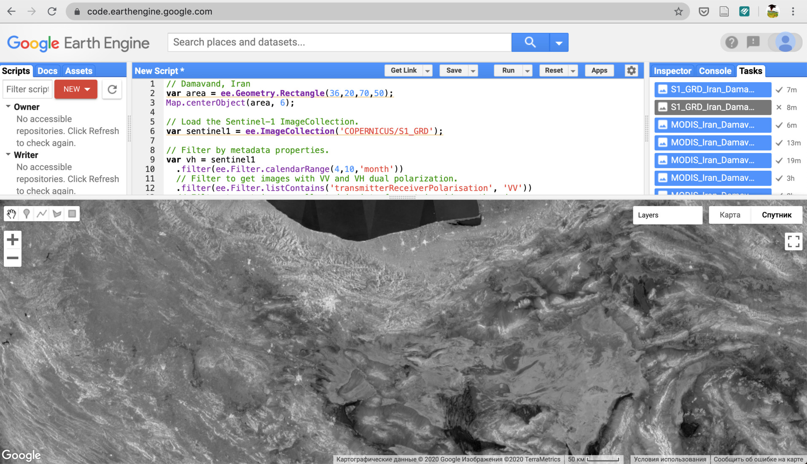
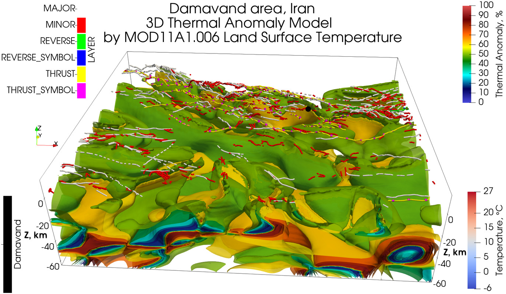
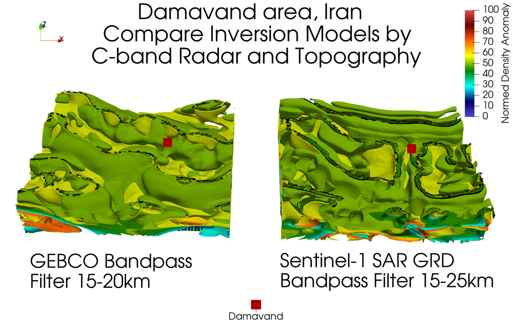

# Mosaics produced by [Google Earth Engine](https://developers.google.com/earth-engine)

## 3D Thermal Inversion Model by MOD11A1.006 Terra Land Surface Temperature and Emissivity Daily Global 1km

## Compare 3D Inversion Models by Sentinel-1 SAR GRD C-band Radar and GEBCO 2019 Topography

