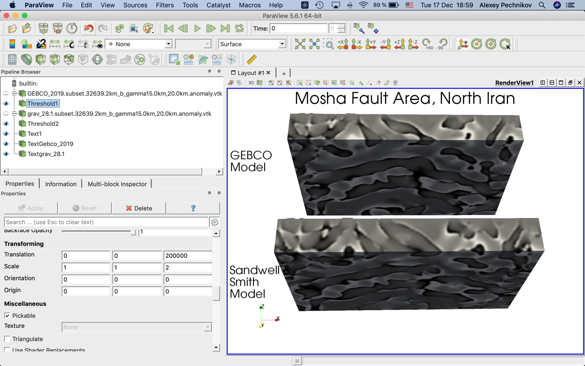
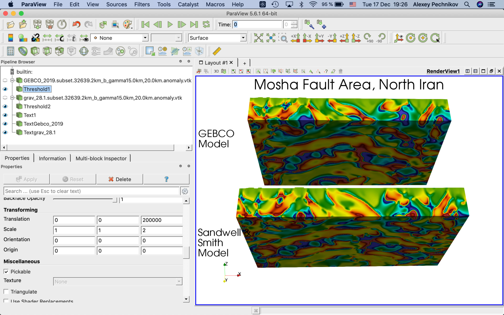
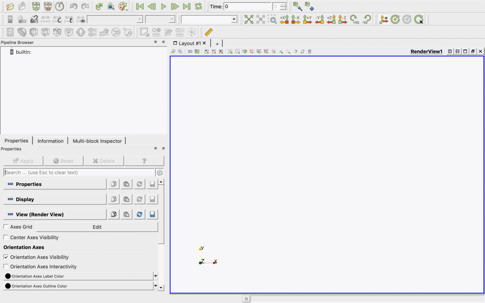

## ParaView-MoshaFault
[ParaView](https://www.paraview.org/download/) project for geological exploration on Mosha fault area, North Iran.

See LinkedIn posts for more details:

[The slices of the 3D model of the density on the Mosha fault area, North Iran](https://www.linkedin.com/posts/activity-6610080454911631360-97-V/)

[Comparing Magnetic and Gravity Data to the Mosha Fault Area](https://www.linkedin.com/posts/activity-6609736436344201216-Kxls/)

[North Iran, Mosha fault](https://www.linkedin.com/posts/activity-6609681862937853952-2BPG/)

[North Iran](https://www.linkedin.com/posts/activity-6609486793676996608-ZF-J/)

## Provided datasets ([EPSG:32639 WGS 84 / UTM zone 39N](https://epsg.io/32639))

  * grav_28.1.subset.*.vtk - our density anomaly models by inversion of [Sandwell and Smith Gravity Anomaly and Vertical Gravity Gradient Open Datasets at 1 arc-minute resolution](https://www.linkedin.com/pulse/sandwell-smith-gravity-anomaly-vertical-gradient-open-pechnikov/) with bandpass filters 40-60km, 60-80km.

  * EMAG2_V2.subset.*.vtk - our magnetic anomaly models by inversion of [WGM2012 Earth's Gravity Anomalies and EMAG2 Earth Magnetic Anomaly Grid are Open datasets at 2-arc-minute resolution](https://www.linkedin.com/pulse/wgm2012-earths-gravity-anomalies-emag2-earth-magnetic-pechnikov/) with bandpass filters 40-60km, 60-80km.

  * GEBCO_2019.subset.*.vtk - our density anomaly models by inversion of [GEBCO_2019 Bathymetry Grid is Open dataset at 15 arc-second resolution](https://www.linkedin.com/pulse/gebco2019-bathymetry-grid-open-datasets-15-arc-second-pechnikov/) with bandpass filters 7.5-10km, 15-20km. See out spectrum components transfer technique [Build Super-resolution Gravity from GGMplus Free-Air Gravity Anomaly (200m) enhanced by SRTM topography (30m)](https://www.linkedin.com/pulse/build-super-resolution-gravity-from-ggmplus-free-air-200m-pechnikov/)

  * earthquakes_us.vtm - [USGS Earthquake Catalog](https://earthquake.usgs.gov/earthquakes/search/)

  * earthquakes_eu.vtm - [EMSC Earthquake Catalog](https://www.emsc-csem.org/Earthquake/?filter=yes)

  * AOI*.vtp,  - [GEBCO_2019 Bathymetry Grid is Open dataset at 15 arc-second resolution](https://www.linkedin.com/pulse/gebco2019-bathymetry-grid-open-datasets-15-arc-second-pechnikov/)

  * Damavand*.vtk - Damavand Volcano location point

  * fault*.vtm - [Major faults in Iran (flt2cg)](https://catalog.data.gov/dataset/major-faults-in-iran-flt2cg)

  * ne_50m_admin_0_countries_lakes.*.vtk - [Natural Earth Admin 0 – Countries without boundary lakes](https://www.naturalearthdata.com/downloads/50m-cultural-vectors/50m-admin-0-countries-2/)

  * *.stl - our 3D STL models.

## How it looks

There are multiple data cubes and sections in the project which could be enabled manually. See below the project screenshots:

## Compare 3D Density calculated with the same parameters on Sandwell and Smith Gravity and GEBCO 2019 topography

## How to open the project

Use [ParaView](https://www.paraview.org/download/) File -> Load State menu item to load the MOSHA.pvsm project file and specify "data" subdirectory as "Data Directory" as on the screen below:

## Authors

A.V.Durandin
https://orcid.org/0000-0001-6468-9757 (ORCID)
E-mail: durandin.andrew@gmail.com

A.O.Pechnikov
https://orcid.org/0000-0001-9626-8615 (ORCID)
E-mail: pechnikov@mobigroup.ru
