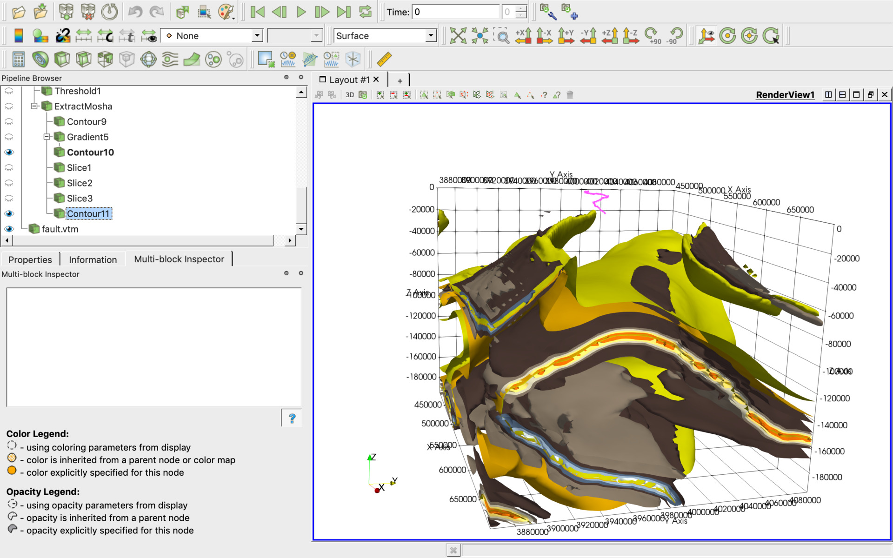
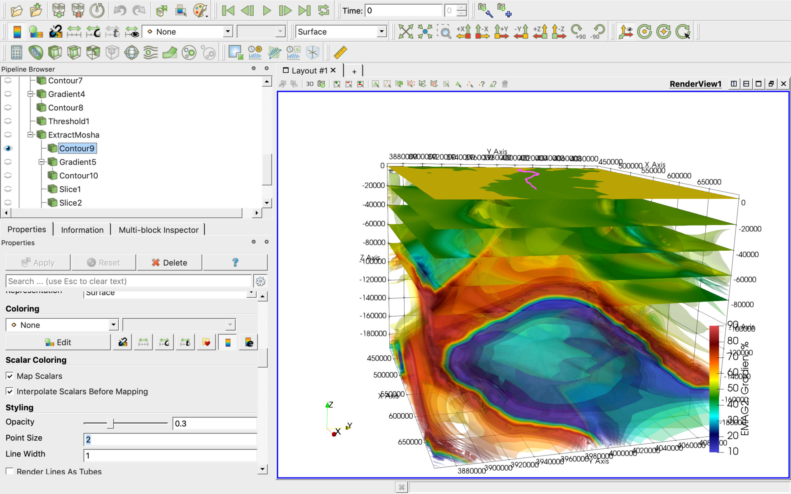
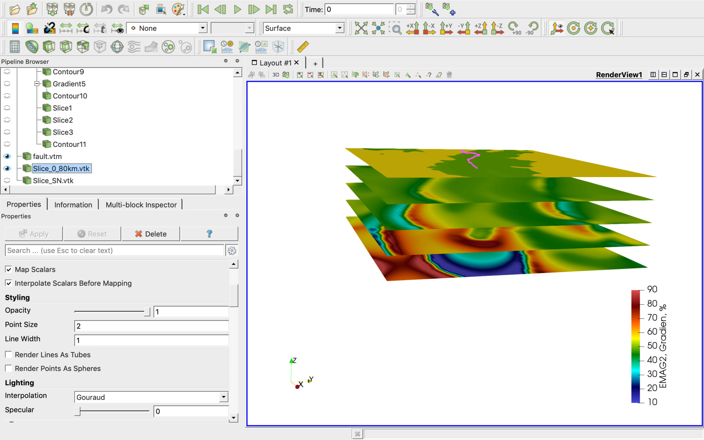
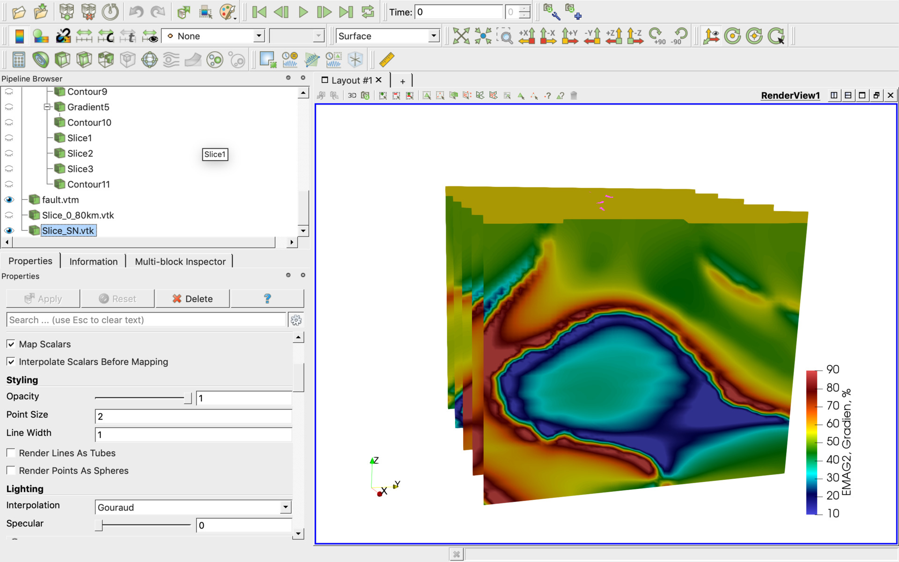
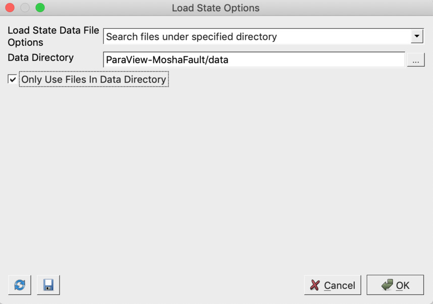

# ParaView-MoshaFault
[ParaView](https://www.paraview.org/download/) project for geological exploration on Mosha fault area, North Iran.

See LinkedIn posts for more details:

[The slices of the 3D model of the density on the Mosha fault area, North Iran](https://www.linkedin.com/posts/activity-6610080454911631360-97-V/)

[Comparing Magnetic and Gravity Data to the Mosha Fault Area](https://www.linkedin.com/posts/activity-6609736436344201216-Kxls/)

[North Iran, Mosha fault](https://www.linkedin.com/posts/activity-6609681862937853952-2BPG/)

[North Iran](https://www.linkedin.com/posts/activity-6609486793676996608-ZF-J/)

# How it looks

There are multiple data cubes and sections in the project which could be enabled manually. See below the project screenshots:

# How to open the project

Use [ParaView](https://www.paraview.org/download/) File -> Load State menu item to load the MOSHA.pvsm project file and specify "data" subdirectory as "Data Directory" as on the screen below:

